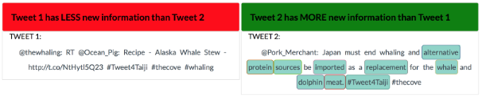
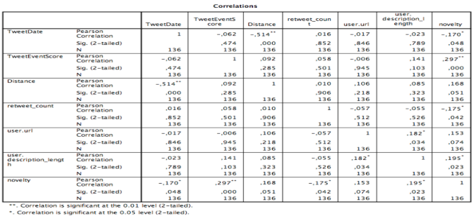
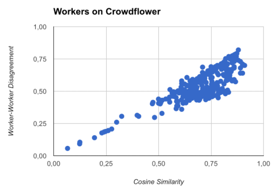
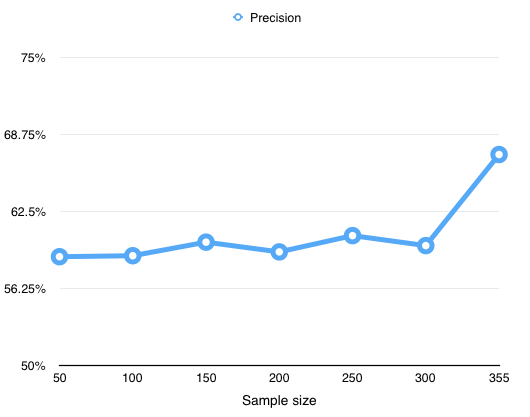
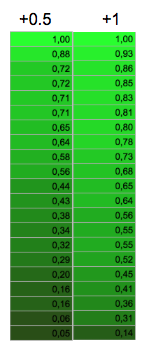

# Novelty Detection
##Crowdsourcing novelty annotation data from tweets regarding the whaling activist event

This repository contains the necessary steps and data collected and executed to produce the results for novelty detection in tweets. First, the collection of tweets and data are elaborated. The tweets are collected based on [seed words](Data/Whaling_Seed_Words.txt) given by activist event experts. In this section each feature is given a description. Subsequently, with the collected data, crowdsource experiments are conducted on the [Crowdflower](http://www.crowdflower.com) platform. The experiments and tasks are written in Javascript and a proprietary markup language from Crowdflower. Furthermore, the [CrowdTruth](http://crowdtruth.org) platform is utilized to detect any sub-groups or spammers contaminating the annotation data.

###Dataset Files
The [seed words](Data/Documents/Whaling_Seed_Words.txt) given by the social scientists at the VU (de Bakker & Hellsten) for whaling event are used to collect tweets from the [Twitter API](https://dev.twitter.com). Various variables are collected statistics like retweet count, favorite count, media-links etc. Besides these data points, other features are also collected or calculated. For relevancy to the whaling event, [data](Data/TweetsRelevancyScores.csv) from another [experiment](https://github.com/CrowdTruth/CrowdTruth/wiki/Tweet-Event-Type-Identification) is used. This tweet event score is collected by Inel via crowdsourcing. Workers annotated at what rate words or sentences relate with the event. Two parts of the collected and processed data are presented here, a short description of the variables are given in the following section. A more detailed description and means of collecting are available in the [paper](Data/factors-indicating-novelty.pdf).

####[Workers](Data/1FirstDay/f762129/aggregated_selections.csv)
- Worker_ID: Unique ID of the worker
- More_novel: Amount of times worker selected more novel for a tweet
- Equally_novel: Amount of times worker selected equally novel for a tweet
- Less_novel: Amount of times worker selected less novel for a tweet
- Irrelevant: Amount of times worker selected irrelevant for a tweet
- Irrelevant_behavior: Percentage of times the worker selected irrelevant for a tweet
- Novelty_selection_percentage: Percentage of times the worker selected a novelty option for a tweet
- Same_answer: True if user continuously only chooses one option
- Average_novel_words: Average novel words highlighted by worker
- Average_NOT_novel_words: Average not-novel words highlighted by worker
- Novelty_cosine_similarity: Cosine similarity measure from CrowdTruth for novelty option for tweets
- Novelty_worker_worker_agreement: Worker agreement measure from CrowdTruth for novelty option for tweets
- Spammer: Worker noted as a spammer by filters

####[Tweets](Data/tweets2015.csv)
- Tweet_ID: Unique ID of the tweet
- Tweet_content: Content text of a tweet
- Tweet_date: Date when tweet was posted
- Tweet_event_score: Rate of event relevance
- Distance_similarity: Smallest Levenshtein distance between former tweets and the selected tweet.
- ID: Tweet ID from the Twitter API
- User.handles: Twitter handles of the user
- User.followers: Amount of followers of user
- User.favorites_count: Amount of tweets the user favorited
- Retweet_count: Amount of times the tweet was retweeted
- Favorite_count: Amount of times the tweet was favorited
- Entities.urls: URL’s in tweets
- Media_type: Type of media in tweet (photo, video or other)
- User.friends_count: Amount of friends of user
- User.listed_count: In how many lists is the user listed
- User.url: URL given by the user for his profile
- User.description_length: Length of description of the user profile
- User.created_at: Date when twitter account was created
- User.profile_image_url: If a custom profile image is used
- User.profile_banner_url: If a custom profile banner is used
- Hashtag: Hashtags in tweet
- Entities_count: Amount of entities in tweet
- Sentiment_score: Sentiment score of tweet
- Novelty: novelty status of tweet

To gather the entities count, three different entities API's are used: [NERD](EntityExtractor/Extractors/NerdApi.py), [TextRazor](EntityExtractor/Extractors/TextRazorApi.py) and [DBpedia SpotLight](EntityExtractor/Extractors/SpotLightApi.py). The [entities count process](EntityExtractor/Process.py) module looks up the words in the tweets and checks if they are entities in one of the three API's. The [output](EntityExtractor/Data/counts.csv) file is written to a local MongoDB database. This file with all found entities are than used as input for the [entities count](EntityExtractor/EntityCount.py) module. This module checks how many entities are found in every tweet and give the entities count as [output](Data/Documents/tweets2015.csv). The sentiment score is calculated with the SentiWordNet API in the [SentimentCalculation](EntityExtractor/SentimentCalculation.py) module.

###Crowdsourcing Experiments

The tasks on the Crowdflower platform consisted of two tasks. **“Novelty selection (1)”** task: is for annotating which tweet is more novel or irrelevant. The second task **“words highlighting (2)”** asks the user to highlight words that were novel, in comparison with the event summary description. The experiments were conducted on Crowdflower and a [description](https://github.com/CrowdTruth/CrowdTruth/wiki/Tweets-Novelty-Ranking) about the template and task design are available.

In the **“Novelty selection”** part of the task the worker is asked to select which tweet is more novel (green banner), equally novel (blue banners for both tweets), less novel (red banner) or irrelevant (grey banner). The novelty selection is done by clicking the banners multiple times. Clicking the banner results into a different selection, the user can keep clicking until the desired option is selected. The next part of the task is the **“words highlighting”** task. For all the novelty conditions, except irrelevant, the worker has to select at least one word in each tweet that is deemed novel by the worker. Multiple words can be clicked one at a time.

###Experiment Results
Correlation results  

Of all the annotations the workers made over all the tweets, every annotation is used to score the novelty of the tweet. If the tweet was selected as more novel it gets a +1, equally novel +0.5 and less novel -1. Aggregating all the score resulted in an ordered list of novel tweets. Tweets above the threshold is noted as novel and under the threshold as less novel. Of 21000 judgements, 137 tweets were scored. This low throughput of annotation data is caused by the comparative nature of the crowdsource task. If a tweet set contained 50 tweets, the first tweet needed 50 comparison. Exhaustively going down this comparison method, creates a lot of judgements. The upside of this comparison method, is that the ambiguity of judgements can be avoided. With the scored [novelty data](Data/tweets2015.csv) correlation analysis showed what features were significant for novelty correlation.

Also with the [cosine similarity](Data/1FirstDay/f762129/CrowdTruth Vectors/AverageCosine.csv) and [worker-worker agreement](Data/1FirstDay/f762129/CrowdTruth Vectors/AverageDisagreement.csv), the annotation quality of workers are available. The majority of workers scored between 0.5 and 0.8 on both accounts. In short worker-worker agreement checks if there are sub-groups within the crowd with their own opinion. Cosine similarity expresses the degree of similarity between annotations of the worker and the the aggregated unit annotation vectors (minus the vectors of that worker). The two measures are calculated with the [Crowdtruth Metrics processes module](CrowdTruthMetrics/MetricsProcess.py). The needed inputs are [CT_NOTnovelwords.csv](Data/1FirstDay/f762129/Vectors/CT_NOTnovelwords.csv), [CT_NoveltyTweetSelection.csv](Data/1FirstDay/f762129/Vectors/CT_NoveltyTweetSelection.csv), [CT_Relevance.csv](Data/1FirstDay/f762129/Vectors/CT_Relevance.csv) and [CT_novelwords.csv](Data/1FirstDay/f762129/Vectors/CT_novelwords.csv). Of each input, two outputs results are created, cosine similarity and worker-worker agreement. Subsequently, all four cosine similarities are averaged together to create an [average cosine similarity](Data/1FirstDay/f762129/CrowdTruth Vectors/AverageCosine.csv). The same is done for the [worker-worker agreement measure](Data/1FirstDay/f762129/CrowdTruth Vectors/AverageDisagreement.csv).

[Modelling](RapidminerSVM) with the support vector machines algorithm showed that more data is needed to reach a more plateaud learning curve. The test set consisted of random set of tweets containing a lot of duplicative or near-duplicative tweets. The test shows that the model with the aid of similarity distance, is highly helpful in indicating spam data (accuracy = 75.61%), but very ineffective at recalling true positives (recall rate = 38.47%). Another test was conducted without these duplicative tweets and a cost matrix was added at the training stage. The cost matrix had a false negative and false positive ratio of 3:1. The recall rate improved to 73.33%

####Workflow
The [data](Data) is stored in six different folders, each one indicating the day where the tweets were created. From the [raw data](Data/1FirstDay) collected from Crowdflower, several vectors are created. One is a csv [CT_NoveltyTweetSelection](Data/1FirstDay/f762129/Vectors/CT_NoveltyTweetSelection.csv) with the worker ID, tweet ID and the corresponding annotated tweet on novelty. Four more documents are created [CT_novelwords](Data/1FirstDay/f762129/Vectors/CT_novelwords.csv), [CT_NOTnovelwords](Data/1FirstDay/f762129/Vectors/CT_NOTnovelwords.csv), [CT_Relevance](Data/1FirstDay/f762129/Vectors/CT_Relevance.csv) and [Consistency](Data/1FirstDay/f762129/Vectors/Consistency.csv). [CT_novelwords](Data/1FirstDay/f762129/Vectors/CT_novelwords.csv) and [CT_NOTnovelwords](Data/1FirstDay/f762129/Vectors/CT_NOTnovelwords.csv) contain respectively information about the highlighted words in the novel tweet and not-novel tweet. [CT_Relevance](Data/1FirstDay/f762129/Vectors/CT_Relevance.csv) contains information if the tweet is deemed relevant and [consistency](Data/1FirstDay/f762129/Vectors/Consistency.csv) tells if the worker did not highlight words in a novel or equally novel tweet.
The next set of documents add extra information about the annotations. The [avg_words](Data/1FirstDay/f762129/avg_words.csv) file contains the average amount of highlighted novel words per worker. The folder [Crowdtruth vectors](Data/1FirstDay/f762129/CrowdTruth Vectors/) contains worker-worker agreement and cosine similarity of each vector the useed average of them. Finally, there is an aggregated file named [aggregated_selections](Data/1FirstDay/f762129/aggregated_selections.csv) containing all the available information. After determining whether a worker is a spammer the results are stored in [Spam Identifications](Data/1FirstDay/f762129/Spam Identifications), [clean_data](Data/1FirstDay/f762129/Spam Identifications/clean_data.csv) contains the annotations without the workers and [counted_scores](Data/1FirstDay/f762129/Spam Identifications/counted_scores.csv) has the aggregated score of novelty of each tweet. Another document [explanation](Data/1FirstDay/f762129/Spam Identifications/explanation.csv) states why a worker was labeled as a spammer.

#####Example of the [aggregated_selections](Data/1FirstDay/f762129/aggregated_selections.csv) file

| worker_ID | more_novel | equally_novel | less_novel | irrelevant | irr_behaviour       | novelty_selection_percentage | same_answer | avg_novel_words | avg_NOT_novel_words | Novelty_Cosine | Novelty_Worker_Disagreement | spammer | manually_checked |
|-----------|------------|---------------|------------|------------|---------------------|------------------------------|-------------|-----------------|---------------------|----------------|-----------------------------|---------|------------------|
| 33903622  | 1          | 18            | 1          | 0          | 0                   | 0.05                         | 0           | 5.74            | 4                   | 0.89           | 0.64                        | 0       | 0                |
| 33793607  | 0          | 20            | 0          | 0          | 0                   | 0                            | 1           | 5.25            | NONE                | 0.89           | 0.68                        | 0       | 0                |
| 33761260  | 4          | 4             | 4          | 6          | 0.3333333333333333  | 0.222222222222222            | 0           | 3.5             | 2                   | 0.63           | 0.5                         | 0       | 0                |
| 33727304  | 4          | 12            | 4          | 0          | 0                   | 0.2                          | 0           | 4.56            | 1.75                | 0.84           | 0.6                         | 0       | 0                |

*Novelty selection* 
More_novel, equally_novel, less_novel and irrelevant states how many times a worker annotated a tweet as more novel, equally novel, less novel and irrelevant. Irr_behaviour means the percentage of irrelevant the worker chose, so irrelevant quantity divided by the other novelty selection options. Novelty_selection is more_novel quantity divided by the total of novelty annotations. Same answer simply states if the worker always chose the same option. 
 
*Average words highlighted* 
After creating three sets containing information about the highlighted words, the average amount of highlighted words is calculated for each worker. Avg_novel_words is the average of all highlighted words of the more_novel tweet, vice versa for avg_NOT_novel_words. This information can help in determining whether a worker is a spammer or not down the line.

*Cosine distance and worker-worker agreement* 
The next step is to use the Crowdtruth measures to check if the annotation of the worker are qualitative good. The novelty cosine calculates the distance similarity between aggregated annotation of all workers (without the current worker) and the worker itself. The worker-worker agreement checks the degree of agreement of the worker with the other workers. Sometimes a set of workers can disagree with the crowd without being a spammer. Worker-worker agreement can pinpoint to sub-groups within the workers. The Crowdtruth ‘Metrics’ module is calculates these two measures based on the [CrowdTruth metrics](Data/Documents/CrowdTruthMetricsExplanations.pdf).

*[Spammer conditions](https://dl.dropboxusercontent.com/u/50031225/factors-indicating-novelty.pdf#page=8)* 
The gathered and created data can aid in spam detection. Under certain conditions some workers are noted as spammers.

#####Spammer identification with explanation example

| spammer | condition1 | condition2 | condition3 | condition4 |
|---------|-------|--------------|-------|-----------|
| 0       | 0     | 0            | 0     | 0         |
| 1       | 0     | 1            | 0     | 0         |
| 0       | 0     | 0            | 0     | 0         |
| 1       | 1     | 0            | 0     | 0         |

*Spam Detection Methods* 
The above table is an example of the [explanation data file](Data/1FirstDay/f762129/Spam Identifications/explanation.csv), this file states why a worker was identified as a spammer. There are 4 set of conditions a worker has to conform to, before being identified as a spammer. Condition 1 means that the worker exceeded both the threshold on the [cosine distance](https://dl.dropboxusercontent.com/u/50031225/factors-indicating-novelty.pdf#page=7) and [worker-worker agreement](https://dl.dropboxusercontent.com/u/50031225/factors-indicating-novelty.pdf#page=7). Condition 2 means that the worker exceeded either one of those 2 thresholds. Additionally the worker has to confirm one of the following conditions: [worker consistency](https://dl.dropboxusercontent.com/u/50031225/factors-indicating-novelty.pdf#page=8), [worker irrelevant behaviour](https://dl.dropboxusercontent.com/u/50031225/factors-indicating-novelty.pdf#page=8), [worker annotation frequency](https://dl.dropboxusercontent.com/u/50031225/factors-indicating-novelty.pdf#page=8) or avg_novel_words > 2. Condition 3 checks if the [worker irrelevant behaviour](https://dl.dropboxusercontent.com/u/50031225/factors-indicating-novelty.pdf#page=8) > 0.5 and if [worker annotation frequency](https://dl.dropboxusercontent.com/u/50031225/factors-indicating-novelty.pdf#page=8) is true. For condition 4 to be true, the worker has to conform to all three variables. [Worker annotation frequency](https://dl.dropboxusercontent.com/u/50031225/factors-indicating-novelty.pdf#page=8) is true, avg_novel_words selected < 1.2 amount of tweets highlighted > 7. After manually checking and testing 300 workers across 6 crowdsource tasks, with several different parameters, the above stated parameters produced the best [result](Data/Documents/Recall Test.pdf) with an F1 score of 0.82. 
&nbsp;&nbsp;&nbsp;&nbsp;&nbsp;&nbsp;To implement these parameters and detect spammers two input files are used. The [aggregated selection](Data/1FirstDay/f762129/aggregated_selections.csv) this file contains all features needed for spam detection. The second input file is [Consistency](Data/1FirstDay/f762129/Vectors/Consistency.csv). This file contains information to check if a worker failed to highlight words, even though they annotated a tweet as more novel or equally novel. With these two input files the [spammer identification module](SpammerIdentification/spammerConditions.py) is used to implement the above mentioned parameters.

*[Counted novelty per Tweet](Data/MatchSum/)* 
After removing all the spammers from the results, the aggregated novelty score of each tweet is calculated. When a tweet is novel +1, tweet is equal +0.5 and when the tweet is not novel -1. Only giving half a point resulted in a more smooth decrease in novelty score, this transition is visible in the following figure.  
 
